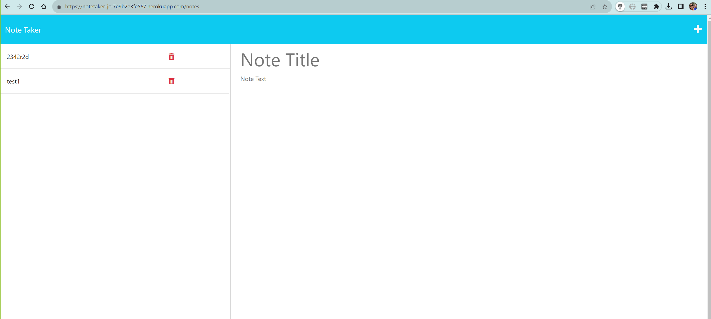

# Note Taker

## Description
This is a Heroku hosted application that allows you to create, save, and delete notes.

## Table of Contents
- [Installation](#installation)
- [Usage](#usage)
- [Credits](#credits)
- [License](#license)
- [Features](#features)
- [Tests](#tests)
- [Contact](#contact)

## Installation
Express and Heroku.

## Usage
Go to the Heroku URL 

## Credits
Jason Cano

## Features
Can apply CRUD (Create, Read, Update, and Delete) to a store file.

## Tests
confirm that the URL works.

## Contact
If there are any questions of concerns, I can be reached at:
##### [github: jasoncano1](https://github.com/jasoncano1)
##### [email: jasoncano0509@gmail.com](mailto:jasoncano0509@gmail.com)
